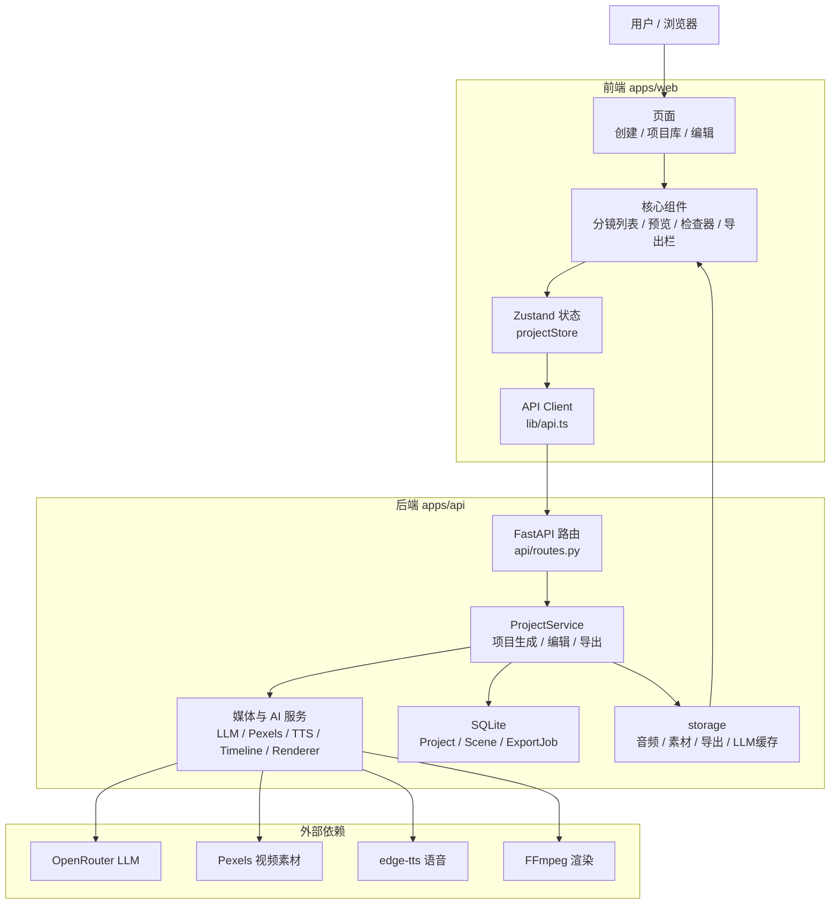

# SpeakCut

NarraClip MVP implementation for turning narration into short-form videos.

## Stack

- Frontend: React 18, TypeScript, Vite, Zustand
- Backend: FastAPI, SQLAlchemy, SQLite
- Video pipeline: FFmpeg, edge-tts
- LLM: OpenRouter OpenAI-compatible API

## Architecture

## Quick Start

1. Copy `.env.example` to `.env.local` for local secrets and machine-specific overrides.
2. Install backend dependencies:
   `python3 -m venv .venv && source .venv/bin/activate && pip install -r apps/api/requirements.txt`
3. Install frontend dependencies:
   `npm install`
4. Start backend:
   `make api`
5. Start frontend:
   `make web`

## Tests

- Backend: `make test-api`
- Frontend: `make test-web`

## Notes

- Requires a reachable network for OpenRouter, Pexels, Edge TTS, and Pixabay.
- Requires `ffmpeg` installed and available on `PATH`.
- Python 3.11 is the target runtime. The current machine does not yet have it installed.
