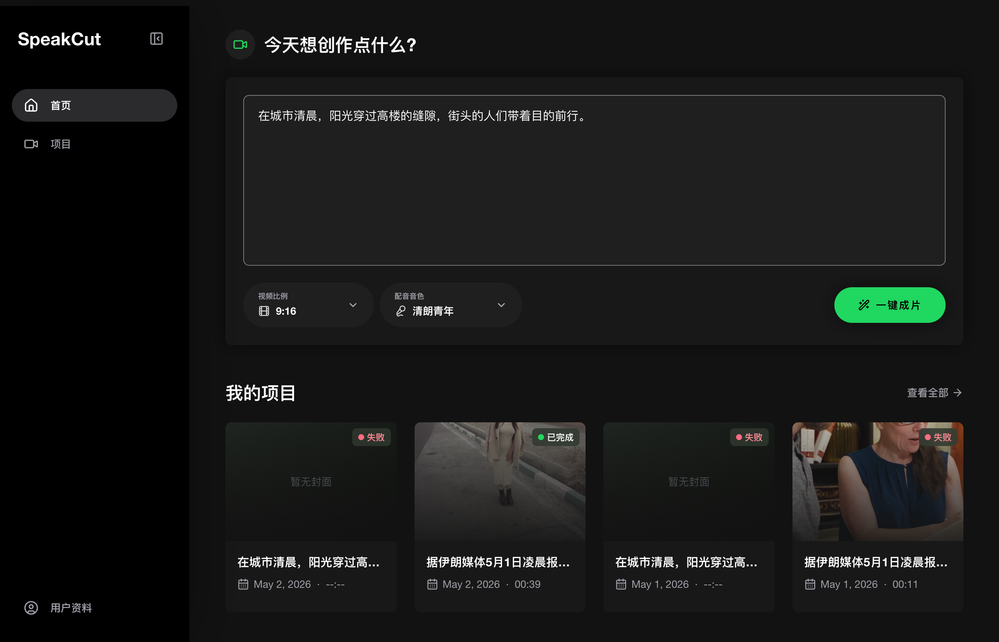
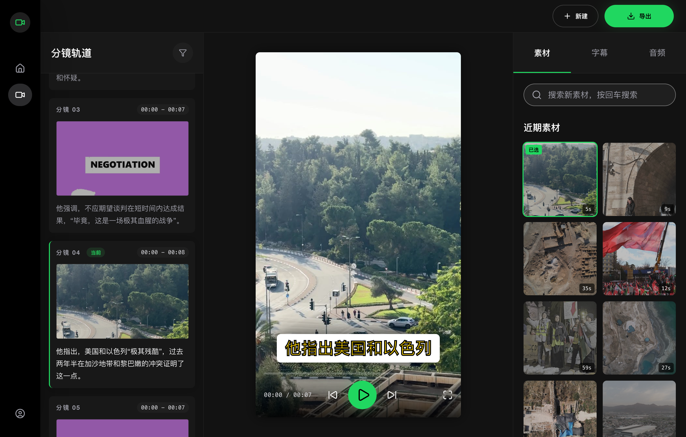
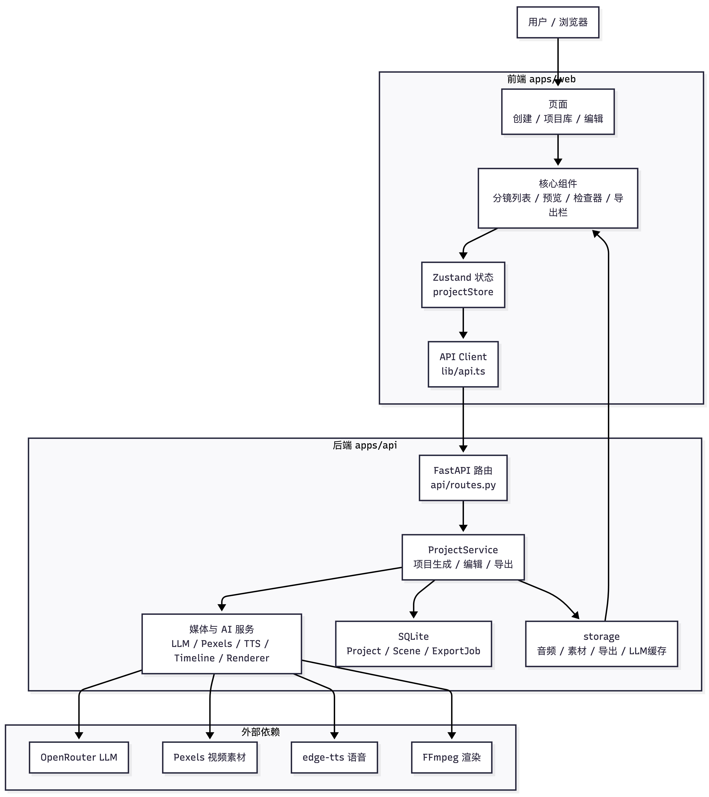
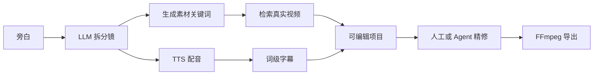
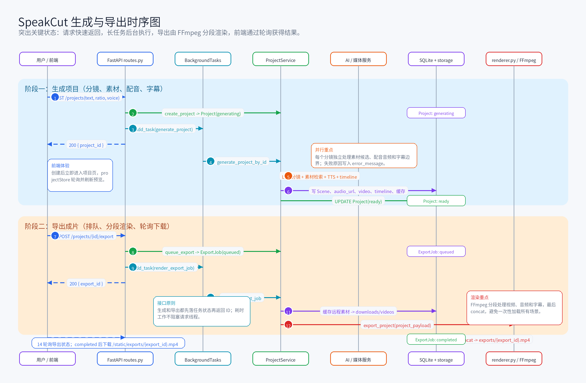
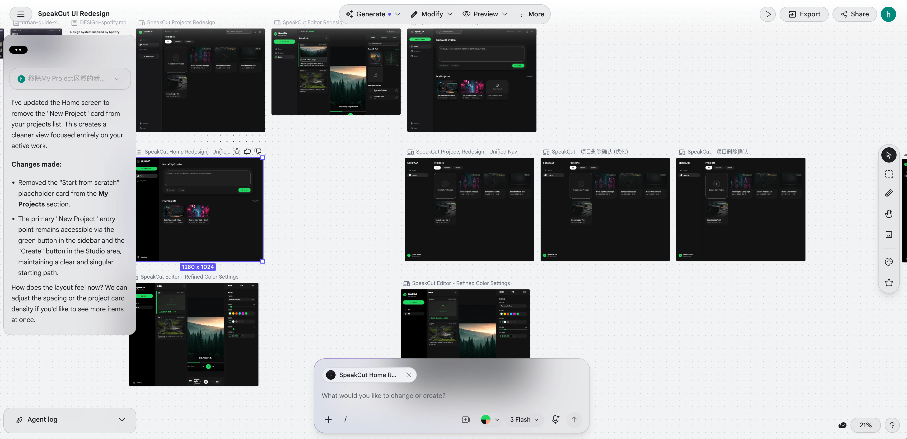
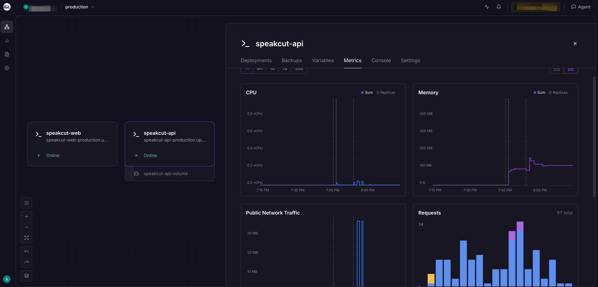

# Vibe Coding 出一款视频自动剪辑工具：SpeakCut 的诞生笔记

我一直觉得，短视频剪辑最累的地方不是剪。

真正消耗人的，是剪之前那串琐碎但绕不开的动作：写脚本、拆分镜、找素材、试配音、对字幕、调节奏、导出、返工。每一步都不难，但它们像很多小石子一样堆在路上。你想表达一个观点，最后却花了大半天在搜索框、下载目录和时间线上来回切换。

所以我做了 SpeakCut。

它的目标很简单：输入一段旁白，让系统先帮你做出一个能看的短视频工程。不是最终完美成片，不是假装懂你审美的黑盒，而是一个已经完成脚本、分镜、素材、配音、字幕、预览、导出的工作台。人可以继续改，agent 也可以继续改。



## 我不想做“又一个 AI 视频生成器”

现在 AI 视频工具大概有两种很有代表性的路线。

一种是 Pixelle-Video 这样的 prompt-to-video。你给一句话，它直接生成视频。这个方向的想象力非常强，因为它把创作门槛压到了最低：不用素材，不用剪辑，不用时间线。

但这里有个问题：短视频不只有“画面动起来”。

尤其是知识解说、新闻摘要、产品介绍、观点表达这类内容，观众对真实感很敏感。画面可以漂亮，但如果质感像模型想象出来的，可信度会掉。更麻烦的是，你很难解释某个画面为什么这样出现，也很难稳定地把它改成你要的版本。

另一种路线是 HeyGen HyperFrames 这种 agent-native video rendering。它用 HTML/CSS/JS 生成 MP4，非常适合让 agent 写代码、渲染图表、生成可复现的视频界面。这个方向的确定性很强，像软件工程一样优雅。

但它更适合“可编程画面”，不一定适合“真实世界画面”。

SpeakCut 想补的是中间那块空白：

> 不让 AI 伪造真实感，而是让 AI 调度真实素材。

也就是说，LLM 不负责生成每一个像素。它负责理解旁白、拆分镜、生成素材搜索词、规划节奏。真实画面来自 Pexels 等 stock video。配音、字幕、渲染、导出交给确定性 pipeline。

这个取舍一点也不性感，但很实用。

因为它把短视频生成从“赌模型一次性出神图”，变成了“让系统先完成 80% 的剪辑流水线”。

## 一个最小但完整的产品闭环

SpeakCut 的第一版只抓一个场景：文本到可编辑短视频。

用户输入一段旁白：

```text
为什么很多人越喝咖啡越困？这背后其实和腺苷、睡眠压力以及咖啡因代谢速度有关……
```

然后系统开始做几件事。

它先读懂这段话，把它拆成几个适合剪辑的场景。每个场景都有一句旁白、一段画面描述、一组素材关键词和一个大致时长。接着它去找真实视频素材，同时生成配音。配音过程中拿到词级时间戳，再用这些时间戳生成字幕。最后，所有东西被组装成一个项目，用户可以在编辑器里预览、换素材、检查字幕、再导出。


这听起来像一个自动化脚本，但产品上有一个关键差别：

**SpeakCut 生成的不是一个死掉的视频文件，而是一个活着的剪辑工程。**

这是我很早就确定的原则。很多一键生成工具最大的问题不是生成慢，而是生成完之后不好改。它们给你一个结果，结果不对你就只能重新抽卡。

SpeakCut 不想这样。

它会保留项目结构：Project、Scene、Asset、Subtitle、Audio、ExportJob。每个场景知道自己用了什么素材，字幕对应哪段音频，导出任务当前是什么状态。这样人可以在 Web UI 里改，agent 也可以通过 patch 操作改。



这个设计还有一个副作用：SpeakCut 天然不是只给人用的。

人用的是 Web UI。Agent 用的是 CLI 和 stdio JSON：

```bash
npx speak-cut generate --text "..." --export
```

它们背后是同一个项目模型。不是“先做一个产品，再补一个 API 给 agent”，而是从第一天就把 agent 当成用户。

## 技术上，其实只有一条主线

SpeakCut 的技术架构不复杂。React 前端，FastAPI 后端，SQLite 存状态，文件系统存媒体，FFmpeg 做视频渲染。



真正重要的不是技术栈，而是职责边界。

LLM 只做语义判断：理解文案、拆分镜、写画面描述、生成搜索词。

后端服务做确定性工作：创建项目、保存场景、调用素材 API、生成配音、对齐字幕、管理导出任务。

FFmpeg 做它最擅长的事：裁剪、缩放、叠字幕、合成音频、拼接 MP4。

前端只负责把这些状态呈现出来，让用户能看懂当前项目发生了什么，并在必要时介入。

整个生成链路可以理解成这样：



项目里也有一张更完整的时序图：



这里踩过几个很现实的坑。

第一个坑是字幕。最开始很容易想到按句子长度平均分配时间，但效果会很假。真正看起来舒服的字幕，必须跟语音节奏贴近。所以 SpeakCut 选择依赖 `edge-tts` 的 `WordBoundary`，拿词级时间戳来构建字幕 timeline。

第二个坑是导出。视频导出很容易把系统拖死。如果把多个视频片段一次性读进 Python 内存里处理，demo 可能能跑，稍微长一点就会变慢、爆内存、卡住请求。SpeakCut 最后走的是更朴素的 FFmpeg 路线：每个 scene 独立渲染，再 concat 成最终 MP4。

第三个坑是长任务。LLM、TTS、素材下载、FFmpeg 都不是毫秒级动作。它们不能直接压在 request handler 里。于是生成和导出都变成后台任务，前端轮询状态。用户看到的是一个项目在变得完整，而不是一个网页在等待超时。

这些选择没有什么“黑科技”，但它们让产品开始像一个真正能用的工具。

## 设计不是装饰，是给 agent 的约束

我先用 Google Stitch 做了几轮设计探索。

不是为了产出一套完美 UI，而是为了尽快确定产品气质：它应该是一个工作台，不是营销页；应该高密度、暗色、内容优先；绿色只做功能强调，不做装饰；用户打开第一屏就应该开始生成，而不是先读一堆价值主张。



仓库里的 `DESIGN.md` 也定了类似方向：Spotify-inspired dark mode，近黑背景，内容发光，控件紧凑，界面退到后面。

这件事对 vibe coding 很重要。

很多人以为 agent 写前端最大的问题是代码，其实不是。最大的问题是“没有品味约束”。你不给它一个清晰的产品气质，它就会把每个页面做成默认 SaaS 模板：大 hero、渐变、卡片、无意义的说明文案。

设计文档和 Stitch 截图给了 Codex 一个稳定坐标系。它知道 SpeakCut 应该像剪辑工作台，而不是像 AI 工具官网。于是后面的实现就少了很多偏航。

## Codex 改变的是试错速度

这个项目最有意思的地方，是它真的让我感受到 coding agent 对产品开发方式的改变。

以前做一个这样的 MVP，我会倾向于先想很久：模型怎么拆分镜？数据结构怎么设计？导出怎么排队？前端编辑器怎么拆组件？CLI 要不要做？部署怎么配？

想得越久，越容易把项目想重。

用 Codex 之后，节奏变了。

我可以先说一个方向：做一个输入旁白、自动生成短视频项目的工具。Codex 先读仓库，给出一个能跑的最小版本。跑起来后，问题会自己浮出来。

字幕不准，就改字幕生成。

导出阻塞，就改成后台 job。

前端页面变重，就拆 store 和组件。

Agent 需要使用，就补 CLI 和 stdio JSON。

部署要上线，就装 Railway skill，直接让 agent 操作。

这不是“少思考”。恰恰相反，它让思考更贴近事实。

以前我们经常在还没运行任何东西时，就试图把所有细节想清楚。现在可以先构造一个真实系统，再围绕真实反馈修正。这个过程很像训练一个 agent：给目标，观察行为，修 prompt、修工具、修环境，直到它稳定完成任务。

所以我理解的 vibe coding 不是随便写代码。

它是把软件开发从“瀑布式想象”拉回“快速行动 + 高频反馈”。

## 部署这件事，也被 agent 化了

SpeakCut 后来部署到 Railway。

过去部署一个全栈小应用，通常要自己开控制台、建服务、配变量、配域名、看日志、查构建失败。每一步都不难，但会不断打断产品开发的上下文。

这次我直接安装 Railway skill，让 Codex 帮我完成部署动作。后端服务、前端服务、环境变量、域名和状态检查，都通过对话和命令完成。



这个体验很像把 DevOps 也放进了产品迭代循环：

```text
实现一个版本
本地验证
部署到 Railway
拿到真实 URL
试用
继续改
```

对早期产品来说，这比“架构完美”更重要。你越快把东西放到真实环境，越快知道它到底是不是一个产品，而不只是一个 repo。

## 我从这个项目里拿到的几个判断

第一个判断：**AI 视频不一定要全生成。**

全生成当然酷，但很多场景需要的是可信、稳定、可编辑。真实素材 + 自动化剪辑，是一条被低估的路线。

第二个判断：**一键生成必须配可编辑结构。**

只给 MP4 的工具，很难进入严肃工作流。真正有价值的是把生成过程留下来，让人或 agent 可以接着改。

第三个判断：**agent 产品要从数据结构开始设计。**

如果状态是散的、错误是糊的、操作不可 patch，agent 就只能在外面点 UI 或重跑命令。SpeakCut 从项目模型、CLI、stdio JSON 开始约束自己，本质是在给 agent 留操作面。

第四个判断：**设计文档不是给人看的摆设。**

在 vibe coding 里，设计文档也是 prompt。它会直接影响 agent 写出来的 UI 是不是像一个产品。

第五个判断：**部署也应该进入 agent workflow。**

当 Railway skill 把部署变成一组可执行、可复查的动作，产品迭代就少了一个很大的摩擦面。

## 结尾：让创作从时间线开始之前就自动化

SpeakCut 现在还只是一个 MVP。素材 ranking 还可以更聪明，字幕样式还可以更丰富，导出 worker 还可以更稳定，agent patch 协议也可以更细。

但它已经验证了一个方向：

**短视频创作不必从空白时间线开始。**

你可以先把想表达的话写下来，让系统生成一个结构化视频工程。它未必完美，但它已经有脚本、有分镜、有真实素材、有配音、有字幕、有导出路径。接下来，人做判断，agent 做操作，工具负责把重复劳动吃掉。

这就是我想要的 SpeakCut。

不是替你创作，而是把创作前那段最磨人的路，先铺平。

## 参考

- Pixelle.AI: <https://pixelle.ai/>
- HyperFrames: <https://hyperframes.video/>
- HyperFrames About: <https://hyperframes.video/about>
- SpeakCut README: [../README.md](../README.md)
- SpeakCut Design System: [../DESIGN.md](../DESIGN.md)
